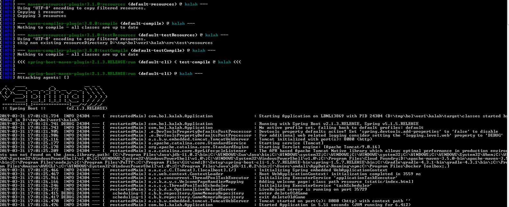
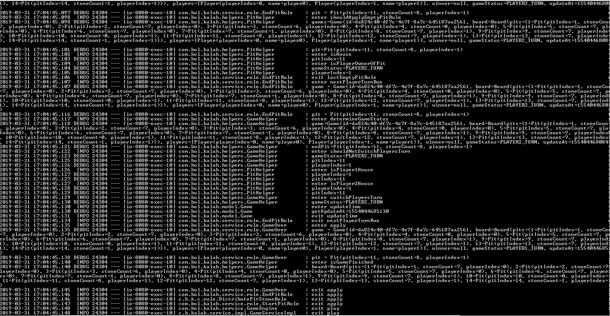

# Kalah Game PoC

## Prerequisites:
* [Java 11](https://www.oracle.com/technetwork/java/javase/11-0-2-relnotes-5188746.html)
* [Apache Maven 3.5.0](https://maven.apache.org/download.cgi) or later
* Allowed to open connection to download required jars from central maven repository

## Building and Running Instructions

## Technologies & Tools Used:
* [Java 11](https://www.oracle.com/technetwork/java/javase/11-0-2-relnotes-5188746.html)
* Spring Boot
* [Apache Maven](https://maven.apache.org/download.cgi)
* jmockit 1.34
* [pmd](https://pmd.github.io/)
* [spotbugs](https://spotbugs.github.io/)
* [docker CE](https://docs.docker.com/engine/release-notes/)
* AngularJs 1.7.8
* HTML
* CSS
* [lombok](https://projectlombok.org/)

Before running app, ensure that port 8080 is free. One can use server.port application.properties to override default 8080 port.

---

# Steps to execute the application on Windows 7 and onwards machine's command prompt:

clone or download git repository https://github.com/amit-dali/kalah-final 

To run webapplication using JRE11;

```
> cd kalah-final\executable
```

```
> java -jar kalah-0.0.1-SNAPSHOT.jar
```

OR

To run webapplication manually using maven;

```
> cd kalah-final
```

```
> mvn spring-boot:run 
```

(Note: It starts the application. Do not close windows command window or do not press Ctrl + c. It will kill the application process.)

If application is up, you will see something like following screenshot at end of command line console;



(Note*: Last line from above screen shot says that application is up and running)

------

To manually test/verify this PoC:
 
1) In web browser hit url : http://localhost:8080/. You will see following webpage;

2) To stop application, press "Ctrl + c" and then select "Y". This will bring down the application. 

-------

To generate/view unit test report execute following command:

```
> mvn test
```

Note*: Above command will execute unit test cases for the application and will generate unit test reports at following location under tracker project directory;

```
> cd target\surefire-reports
```

You can also see the generated unit test case reports in this github repository under folder unit_test_reports

---

To java code quality analysis report of PMD tool/lib, execute following command:

```
> mvn pmd:pmd
```

Note*: Above command will run code analysis tool PMD on the solution code and generate html report at following location

```
> target\site\pmd.html
```

You can also see the generated unit pmd and spotbugs code analysis reports in this github repository under folder code_analysis_reports.

---

You can view application logs on the console as shown below;



------

Optionally you can try run this webapplication in docker container (just tested till application start-up on centos linux, not tested the web application running on docker container):

* Use Dockerfile from the root folder and build docker image, make sure bothe "kalah-0.0.1-SNAPSHOT.jar" and dockerfile are in same directory 
* start docker container with the built imag
------

## Author
Amit Dali (amit.dali@gmail.com)


